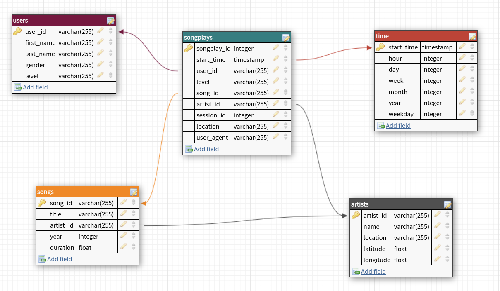

# Sparkify, Your World Best Music Library Provider : The Spark-Lake episode :)

This repository contains scripts for **E**xtracting music data from AWS S3 bucket and loading into **AWS EMR** cluster using **Spark**, **T**ransform these data to conform to the below tables represented by a star schema, and **L**oad the transformed data back to s3 bucket as parquet files, which will be our **DataLake**. Each table is written in s3 in its own folder -> we'll have 5 folders in our s3 bucket.

Following is a diagram representing the database schema, with 1 fact table `songplays` and 4 dimension tables `users`, `time`, `songs` and `artists` :



The database design follows a `star schema` to help our analyst team, **The Sparkalysts**, in their mission to answering the questions running through the head of our CEO **The Big Spark** such as :

1. List of songs listened by user `Lily` `Koch` ?
2. In which year did our users listened the most to music ?
3. ...

## Project dataset

We have two datasets stored on S3 buckets :
* song data : json files representing a subset of the **Million Song Dataset**; sample of song file below :
	```json
	{
		"song_id": "SOUYDPQ12A6D4F88E6",
		"num_songs": 1,
		"title": "Tears Of Joy",
		"artist_name": "Wendy & Lisa",
		"artist_latitude": null,
		"year": 1989,
		"duration": 278.46485,
		"artist_id": "ARN4X0U1187B9AFF37",
		"artist_longitude": null,
		"artist_location": ""
	}
	```
* log data : json files representing our users' activities regarding the songs; sample log record :
	```json
		{
			"artist": null,
			"auth": "Logged In",
			"firstName": "Walter",
			"gender": "M",
			"itemInSession": 0,
			"lastName": "Frye",
			"length": null,
			"level": "free",
			"location": "San Francisco-Oakland-Hayward, CA",
			"method": "GET",
			"page": "Home",
			"registration": 1540919166796.0,
			"sessionId": 38,
			"song": null,
			"status": 200,
			"ts": 1541105830796,
			"userAgent": "\"Mozilla/5.0 (Macintosh; Intel Mac OS X 10_9_4) AppleWebKit/537.36 (KHTML, like Gecko) Chrome/36.0.1985.143 Safari/537.36\"",
			"userId": "39"
		}
	```

## Project Structure

The project is structured as follow:

* A python script `create_s3.py` which contains functions for creating an s3 bucket, and copy the script `etl.py` into it
* A python script `etl.py` which extracts the data from S3 and transforms the log and song data into the above fact and dimensional tables, using pyspark
* A bash script `etl_job.sh` which creates the emr cluster, and run the `etl.py` script as a spark-submit job

## Project Setup

To set everything up, the following environment variables need to be set to be able to access aws resources (s3, ...) :

* AWS_ACCESS_KEY_ID
* AWS_SECRET_ACCESS_KEY

> Note : you'll need to create an IAM user with admin rights if you don't already have one

To set up the project the following steps can be followed in the given order :

* run the following command :
  
	```sh
	python create_s3.py
	```

	This will create an s3 bucket named `sparkify-dl-sp` if it doesn't exist. Then a folder `sparkify-scripts` will be created and the `etl.py` file will be copied into under the name `spark-etl.py`.

* Next, run :
  
	```sh
	./etl_job.sh
	```

	This will create an AWS EMR cluster with 3 nodes and a version = 5.30.0. The script will also submit a spark job using the `etl.py` script copied to s3 in the previous step.

> Note 1: You can change the cluster configuration as you want in the file `etl_job.sh`

> Note 2: The cluster will terminate automaitcally when the jobs are done, due to the --auto-terminate argument in the script

> Note 3: The resulting tables will be saved in s3 under the uri:
> 
* s3://sparkify-dl-sp/sparkify-data/artists
* s3://sparkify-dl-sp/sparkify-data/songplays
* s3://sparkify-dl-sp/sparkify-data/songs
* s3://sparkify-dl-sp/sparkify-data/time
* s3://sparkify-dl-sp/sparkify-data/users

## Design choice

Some tables are partitioned on disk to optimize for queries:

* songs table files are partitioned by year and then artist
* time table files are partitioned by year and month
* songplays table files are partitioned by year and month

In `users` table, for each user timestamp is used to sort the user's data and the more recent information is recorded in the table. This is to account for possibility of user's information update, example a user may have a `free` level in the past and update later to a `paid` level. If we naively drop duplicated records for this user we may mistakenly keep the least recent one.

## TO-DO List

* [ ] Add Analytic Dashboard for easier interaction with the database
* [ ] Run performance benchmark to compare different cluster/spark configuration (number of nodes, partitions, ...)
